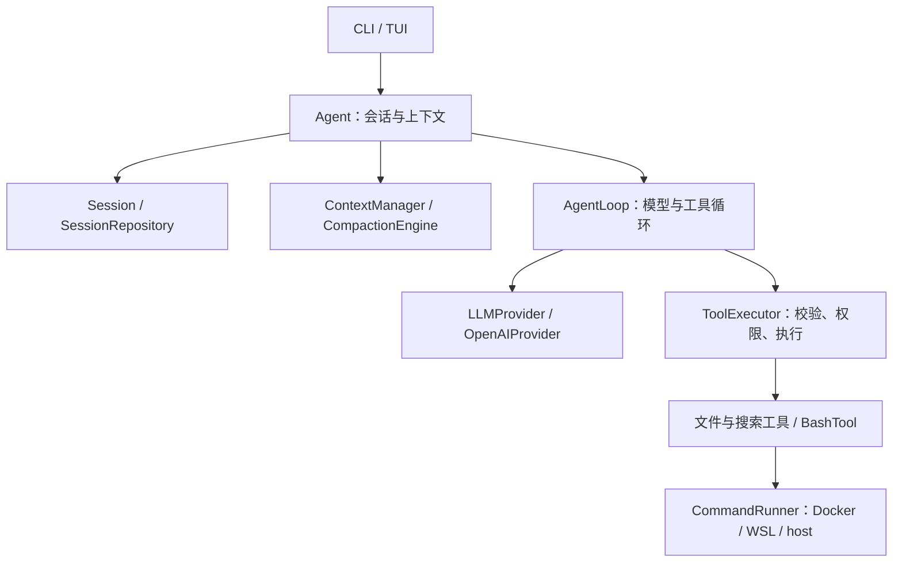

<div align="center">

# Agent Lite

用 Python 实现的交互式 Coding Agent，探索工具调用、会话状态与长对话上下文管理。

[](pyproject.toml)
[](https://github.com/HHN224/agent_lite/stargazers)

</div>

Agent Lite 是一个受 pi-agent 启发的学习与实验项目。它通过 OpenAI 兼容接口连接模型，在终端中读取、搜索和修改文件、执行命令，并保存会话；当前实现包含独立的模型适配层、Agent 核心和 CLI / TUI 应用层。

## 当前能力

- **工具调用循环**：流式接收模型回复，执行工具并回填结果；包含参数校验、权限确认、超时处理、审计记录和循环次数限制。
- **七个内置工具**：`read`、`write`、`edit`、`bash`、`grep`、`ls`、`find`。
- **两种终端界面**：行式 CLI，以及基于 Textual 的 TUI，后者提供 Markdown 消息卡片、可折叠工具结果和运行中插话。
- **会话持久化**：自动保存、恢复最近会话、按 ID 恢复，以及新建、命名、列出和删除会话。
- **上下文管理**：结合 API 输入 token 用量与新增内容估算，在阈值处生成摘要并保留近期原文；超长工具输出截断后保存全文。
- **任务模式与图片输入**：提供 `default` / `plan` / `code` / `review` 系统提示词；TUI 可通过 `/image` 发送本地图片，是否可识别取决于所选模型。
- **可替换命令后端**：Docker、WSL、宿主机执行，以及自动探测。

## 快速开始

### 1. 安装

建议使用 **Python 3.12+**。打包配置目前声明 Python 3.10+，但 TUI 源码使用了 Python 3.12 才支持的 f-string 语法；当前入口会尝试导入 TUI，使用 3.12+ 可避免这一兼容问题。

```bash
git clone https://github.com/HHN224/agent_lite.git
cd agent_lite
python -m venv .venv
```

激活虚拟环境：

```powershell
# Windows PowerShell
.venv\Scripts\Activate.ps1
```

```bash
# Linux / macOS
source .venv/bin/activate
```

安装运行依赖和可选 TUI：

```bash
python -m pip install -e ".[tui]"
```

只需要 CLI 时可安装 `python -m pip install -e .`。未安装 Textual 时，默认界面会回退到 CLI。Docker 并非必装依赖，仅 Docker 后端需要它。

### 2. 配置模型密钥

复制仓库根目录的 `.env.example` 为 `.env`，填写 `CMD_API_KEY`。程序会加载项目根目录的 `.env`，并尝试加载当前目录的环境配置；已设置的环境变量不会被覆盖。

`.env` 和 `sessions/` 已加入 `.gitignore`。默认使用 Command Code 和 `CMD_API_KEY`，不需要 DeepSeek 官方密钥。使用 `--provider deepseek` 时读取 `DEEPSEEK_API_KEY`。

**Command Code GOAT 套餐：** 在 [Studio](https://commandcode.ai/settings/keys) 创建 API key，将 `CMD_API_KEY=你的密钥` 加到本地 `.env`，然后运行：

```powershell
agent-lite --bypass --sandbox wsl
```

默认端点为 `https://api.commandcode.ai/provider/v1`，模型为 `deepseek/deepseek-v4.1-flash`。官方说明 [GOAT 支持 API 调用并计入套餐额度](https://commandcode.ai/docs/plans/goat#api-support)；模型仍受套餐可用范围限制。本适配器使用 [Chat Completions 协议](https://commandcode.ai/docs/provider)，支持文本、图片、思考流、工具调用和 usage；Claude 的 Anthropic Messages 协议暂未接入。对话和上下文压缩使用同一个 provider，不会回退到 DeepSeek 官方 API。

### 3. 启动

先使用 CLI 体验文件读取和权限确认：

```bash
agent-lite --ui cli
```

在 `>` 后输入任务，例如：

```text
读取 README.md，列出这个项目的主要模块。
```

安装了 Textual 后，直接执行 `agent-lite` 即可进入默认 TUI。也可以使用 `python -m coding_agent` 启动。

程序默认恢复最近会话。要新开一个有名称的会话：

```bash
agent-lite --ui cli --new --name "代码阅读" --workspace .
```

启动时会显示会话 ID、存档位置、工作目录和实际命令后端。默认通过 Command Code 使用 `deepseek/deepseek-v4.1-flash`。对话和上下文压缩摘要使用同一 provider 和模型，也可使用 `--model` 指定其他模型。

## 界面与会话命令

| 命令 / 操作 | CLI | TUI |
| --- | --- | --- |
| `/new` | 新建会话，沿用当前任务模式 | 同左 |
| `/clear` | 清空当前历史并保存 | 同左 |
| `/mode default`（也可选 `plan` / `code` / `review`） | 切换系统提示词 | 同左 |
| `/sessions` | 列出会话及 ID | 同左 |
| `/resume 会话ID` / `/older` | 未提供 | 切换会话 / 加载更早记录 |
| `/bypass` / `/bypass off` | 使用启动参数 `--bypass` | 自动通过工具请求 / 恢复原权限策略 |
| `PgUp` / `PgDn` / `Ctrl+End` | 使用终端滚动 | 翻页 / 恢复跟随最新输出；滚轮上翻暂停跟随 |
| `/compact` | 手动生成上下文摘要 | 同左 |
| `/name 显示名` | 重命名当前会话 | 未提供 |
| `/delete 会话ID` | 确认后删除非当前会话 | 未提供 |
| `/help` | 未提供；启动参数见 `--help` | 显示界面命令 |
| `/image 本地图片路径` | 未提供交互命令 | 读取图片并发送给模型 |
| 运行中发送补充说明 | 等待本轮结束后输入 | 加入插话队列，在循环检查点交给模型 |
| `Ctrl+C` | 执行中中止本轮；等待输入时退出 | 执行中请求停止；空闲时清除草稿或退出 |
| `Esc` / `Ctrl+D` | — | 请求停止 / 退出 |

任务模式只改变提示词，**不会改变工具权限**。例如 `plan` 不是强制只读模式；需要拒绝写入和命令执行时，请使用 `--permission-policy deny`。

TUI 显示模型思考文本，并在状态栏标记当前阶段、耗时和调用轮数。任务没有最大轮数限制；完成、用户停止或不可恢复错误时结束。自动上下文压缩也会在工具轮次之间检查。Esc 在下一安全检查点停止，无法强制打断已进入的同步网络读取或外部工具。恢复会话时也显示已保存的思考文本。

Windows 输入解析会区分终端能力回复与用户按键，并处理跨批次到达的控制序列。shell 工具为非交互命令，标准输入关闭，Windows 子进程不共享 TUI 控制台。`write` 自动创建工作目录内缺失的父目录。图片工具结果在发送 API 时转换成配套的用户图片消息，保留工具调用配对和原始会话存档。

会话保存于项目根目录的 `sessions/<id>.json`，默认恢复最近更新的会话。`--session` 接受已有 ID（1–64 位字母或数字），不是展示名，且优先于 `--new`；可先用 `/sessions` 查看 ID，再重新启动恢复。

## 启动参数

完整帮助：`agent-lite --help`。

| 参数 | 默认值 | 说明 |
| --- | --- | --- |
| `--ui` | `tui` | `tui` 或 `cli`；缺少 Textual 时回退 CLI |
| `--provider` | `commandcode` | `commandcode`（GOAT）/ `deepseek` |
| `--workspace` | 当前目录 | 文件工具的默认根目录和命令工作目录 |
| `--session` | 空 | 恢复指定会话 ID；也可由进程环境变量 `AGENT_SESSION` 指定 |
| `--new` | 关闭 | 不恢复最近历史，新建会话 |
| `--name` | 空 | 新建会话的展示名 |
| `--mode` | `default` | 新建会话使用的任务模式；恢复会话保留已存提示词 |
| `--model` | 随 provider 选择 | DeepSeek: `deepseek-flash`；Command Code: `deepseek/deepseek-v4.1-flash` |
| `--base-url` | 随 provider 选择 | 可覆盖 OpenAI 兼容接口地址 |
| `--permission-policy` | `ask` | `ask` 确认 / `deny` 拒绝 / `auto` 放行危险工具 |
| `--bypass` | 关闭 | 等同 `--permission-policy auto` |
| `--sandbox` | `auto` | `auto` / `docker` / `wsl` / `host` |
| `--bash-image` | `python:3.12-slim` | Docker 后端所用镜像 |
| `--context-window` | `128000` | 上下文计量窗口；设为 `0` 关闭自动上下文检查 |
| `--compact-threshold` | `0.8` | 自动压缩触发占比 |
| `--compact-retain` | `0.16` | 压缩时尾部原文的目标预算，占窗口的比例 |
| `--compact-max-tokens` | `2000` | 摘要提示词中的长度目标；当前不是 API 硬性输出上限 |

## 工具与执行边界

| 工具 | 用途 |
| --- | --- |
| `read` | 读取带行号的文本，可指定 `offset` / `limit` / `max_chars`（默认 2000 行、6000 字符）；读不完时结果自带「已显示第 A–B 行，共 N 行」与下一段 `offset`；图片转为多模态内容 |
| `write` | 写入 UTF-8 文本 |
| `edit` | 精确替换唯一匹配的字符串；不存在或多处匹配时返回错误 |
| `bash` | 通过选定后端执行命令，返回退出码、标准输出和错误输出 |
| `grep` | 搜索文件内容，支持正则、字面量和文件过滤 |
| `ls` | 列出目录内容 |
| `find` | 按名称及其他条件查找文件或目录 |

`write`、`edit`、`bash` 标记为危险工具，受权限策略控制。默认 `ask` 使用终端 `y/N` 确认；当前 TUI 也沿用该确认函数，尚无专用审批弹窗，需要逐次确认时建议使用 CLI。

`read` 的单次字符预算（默认 6000）低于工具输出的截断阈值（默认 8192），所以「只读到一部分」由 `read` 自己带着行号区间说清楚，而不会被上层从字符中间一刀切掉、毁掉行号结构。写盘的工具全文（`.agent-lite/tool-results/<会话 id>/`）就是普通文本文件，`read` 配 `offset` / `limit` 可分段读完。

`--sandbox auto` 按 **Docker → WSL → host** 探测，最终可能落到宿主机执行。需要指定后端时显式设置参数；指定 Docker / WSL 后若探测不可用，启动会报错，不自动降级。

| 后端 | 实际行为 |
| --- | --- |
| `docker` | 一次性容器，禁用网络、只读根文件系统、512 MB 内存和 100 进程限额；工作目录可写挂载到 `/workspace`，`/tmp` 可写 |
| `wsl` | 在默认 WSL 发行版中通过 Bubblewrap 执行；无网络、系统只读，仅工作目录可写 |
| `host` | 在宿主机通过 `shell=True` 执行；仅设置工作目录，没有文件系统或网络隔离，也不保证使用 Bash |

工具说明书里给模型的是**宿主真实工作目录的绝对路径**，而不是容器内的 `/workspace`：后者只是 bash 侧的别名，`read` / `write` / `edit` 并不认识它，直接写 `/workspace/...` 会被 `safe_path` 拒绝。bash 的描述里会同时点明两者的关系（真实路径 + 仅限 bash 的容器别名），避免模型把别名当成自己的工作目录。

使用 Docker 前启动 Docker 服务并准备镜像：

```bash
docker pull python:3.12-slim
agent-lite --ui cli --sandbox docker
```

使用 WSL 后端前，准备一个普通 Linux 发行版并安装 Bubblewrap（不要使用 Docker Desktop 的内部发行版）：

```powershell
wsl --install -d Ubuntu-24.04
wsl --set-default Ubuntu-24.04
```

```bash
sudo apt update
sudo apt install bubblewrap
sudo mkdir -p /workspace
```

建议在该发行版的 `/etc/wsl.conf` 中关闭 Windows 程序互操作；保留自动挂载，以便 Bubblewrap 只把当前工作目录映射到 `/workspace`：

```ini
[automount]
enabled=true

[interop]
enabled=false
appendWindowsPath=false
```

修改后在 PowerShell 运行 `wsl --shutdown`，再使用：

```bash
agent-lite --ui cli --sandbox wsl
```

`read` / `write` / `edit` 使用 `safe_path` 限制路径，但当前搜索、目录工具与 TUI `/image` 并未统一采用这一检查。因此 `--workspace` 不能视作整个程序的安全沙箱，Docker/WSL 的隔离也只覆盖 `bash` 命令执行。WSL 后端不提供 Docker 后端的内存和进程数限制。

## 上下文如何管理

1. **计量**：以服务端返回的 `prompt_tokens` 校准已有输入，用启发式方法估算新增内容；不是精确 tokenizer 计数。
2. **工具输出截断**：超过默认 8192 字符的文本结果生成预览，全文写入工作目录内的 `.agent-lite/tool-results/<会话 id>/`，返回结果带有保存路径与「如何读回全文」的提示。写盘位置必须在工作目录内，否则 `read` 的 `safe_path` 会拒绝该路径，模型就永远读不回自己的工具输出。任何截断都会在正文里自曝：说清从哪边截的、丢了多少字符，并给出继续读全文（`read` 的 `offset`/`limit`）或缩小查询范围的具体做法，模型不会在毫不知情的情况下基于残缺输出下结论。
3. **自动摘要**：每次用户请求开始时检查占用，达到默认 80% 阈值后，通过独立模型调用总结旧消息，并保留近期原文；没有合适切点时跳过。
4. **重建模型输入**：会话用追加式条目链记录消息与压缩事件，从历史中派生“系统提示词 + 摘要 + 保留消息”，压缩不直接删除旧历史条目。

摘要会额外调用模型；`--context-window` 是本地计量配置，不会更改服务端模型的实际窗口。当前自动检查发生在用户请求开始处，不能保证单次长工具循环内不会超窗。

## 项目结构

```text
agent_lite/
├── agent_core/          # 对话状态、事件循环、工具执行、会话与上下文管理
├── ai/                  # 工具 Schema、Provider 契约与 OpenAI 兼容实现
├── coding_agent/        # CLI / TUI、任务模式、具体工具与命令后端
├── docs/
│   ├── research/        # 上下文管理调研与综合建议
│   └── context-management-plan.md
├── tests/               # FauxProvider 驱动的确定性测试与模块测试
├── .env.example         # 环境变量示例
├── BLOG_Day1_Agent_Runtime.md
├── BLOG_Day2_UTF8_Bash_Bug.md
├── BLOG_Day3_Context_Anchor_Delta.md
├── README.md
├── pyproject.toml       # 依赖、可选依赖与 agent-lite 命令入口
├── requirements-dev.txt
└── requirements.txt
```

运行后产生的 `sessions/` 与工作目录内的 `.agent-lite/` 都不纳入版本控制。



模型协议封装在 `ai`，核心循环不依赖具体 CLI、TUI 或命令后端。应用入口负责组装 Provider、工具、会话和上下文策略；新工具实现 `AgentTool`，新命令后端实现 `CommandRunner`。

## 开发与阅读

```bash
python -m pip install -e ".[dev,tui]"
python -m pytest
```

测试覆盖工具执行与校验、沙箱、会话恢复、模型循环、上下文计量与压缩、输出截断、模式、图片内容和插话等；模型循环测试通过 `FauxProvider` 构造确定性事件。TUI 测试直接导入 Textual 界面模块，因此运行完整测试集需要安装 `tui` 可选依赖。

| 文档 | 内容 |
| --- | --- |
| [Agent Runtime](BLOG_Day1_Agent_Runtime.md) | 核心运行时的开发记录 |
| [Windows UTF-8 命令输出问题](BLOG_Day2_UTF8_Bash_Bug.md) | 编码问题的排查与处理 |
| [上下文 Anchor + Delta](BLOG_Day3_Context_Anchor_Delta.md) | 上下文计量设计记录 |
| [上下文管理实施计划](docs/context-management-plan.md) | 设计与分阶段规划 |
| [上下文管理调研索引](docs/research/README.md) | 外部实现调研及综合建议 |

开发记录与调研文档保留了阶段性方案；当前运行行为以源码和测试为准。提交功能变更时，请同时更新对应测试和本 README 的参数或行为说明。

## 许可

仓库目前未附带独立的 LICENSE 文件，也未在打包配置中声明许可证。


111
