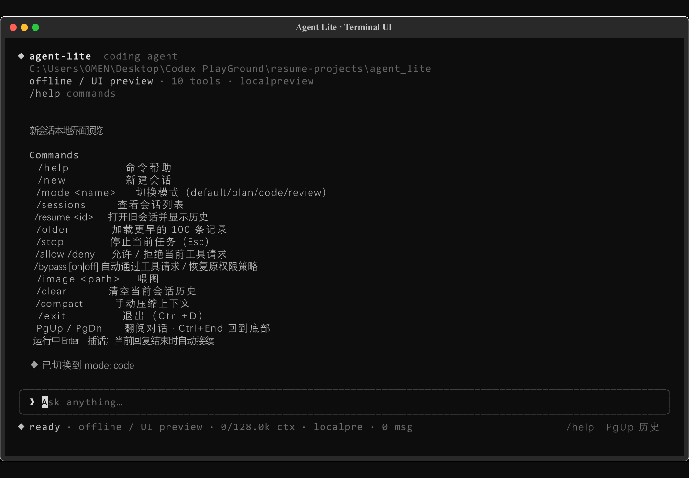
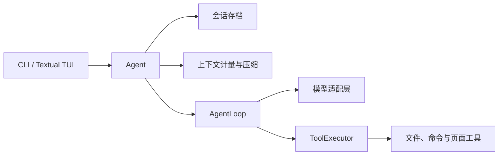

<div align="center">

# Agent Lite

**把 Coding Agent 的运行过程做成一个可交互的终端。**

Python 实现 · 流式工具调用 · 会话恢复 · 长对话上下文管理

[](pyproject.toml)
[](coding_agent/tui.py)
[](pyproject.toml)
[](https://github.com/HHN224/agent_lite/stargazers)

[界面预览](#界面预览) · [快速开始](#快速开始) · [工具](#工具) · [架构](#架构) · [文档](#文档)

</div>

## 界面预览



<p align="center"><sub>原有 Textual TUI 的本地运行预览：展示 /help 与 /mode code，未连接模型 API。</sub></p>

Agent Lite 是受 pi-agent 启发的 Python Coding Agent 学习与实验项目。它通过 OpenAI 兼容的 Chat Completions 接口连接模型，在终端中读取与修改文件、执行工具，并将会话保存到本地。界面提供行式 CLI 和基于 Textual 的 TUI，运行时、模型适配与应用层分别组织。

## 核心能力

| 能力 | 实现方式 |
| --- | --- |
| 工具调用循环 | 接收流式回复，校验工具参数、执行工具并回填结果，继续运行直到完成、中止或不可恢复错误 |
| 交互式终端 | Markdown 回复、工具调用与结果、任务状态；支持 Esc 停止及运行中插话 |
| 会话恢复 | 自动保存历史，新建、列出与恢复会话；保留原始对话条目 |
| 上下文管理 | 用 API 用量校准本地估算；生成摘要、保留近期原文，摘要失败时退避并可用机械摘要兜底 |
| 执行与取件 | Docker / WSL / host 命令后端，按权限策略确认修改操作；通过独立通道取依赖和文件 |
| 页面验证 | `render_page` 捕获运行时错误、验证交互变化，并保存页面截图 |

## 快速开始

使用 **Python 3.12+**。打包元数据目前声明 3.10+，但 TUI 源码包含需要 3.12 的语法；默认入口也会尝试导入 TUI，因此建议统一使用 3.12 或更高版本。

### 1. 安装

以下命令使用 Windows PowerShell：

```powershell
git clone https://github.com/HHN224/agent_lite.git
cd agent_lite
python -m venv .venv
.\.venv\Scripts\python.exe -m pip install -e ".[tui]"
Copy-Item .env.example .env
```

<details>
<summary>macOS / Linux 安装</summary>

```bash
git clone https://github.com/HHN224/agent_lite.git
cd agent_lite
python3 -m venv .venv
source .venv/bin/activate
python -m pip install -e ".[tui]"
cp .env.example .env
```

安装后使用 `agent-lite` 启动；下文 Windows 命令中的 `.\.venv\Scripts\agent-lite.exe` 对应 `agent-lite`。

</details>

### 2. 配置模型

在 `.env` 中填写所选服务的密钥。默认 provider 为 `commandcode`，读取 `CMD_API_KEY`；使用 `--provider deepseek` 时读取 `DEEPSEEK_API_KEY`。

| Provider | 密钥变量 | 代码中的默认模型 |
| --- | --- | --- |
| `commandcode` | `CMD_API_KEY` | `deepseek/deepseek-v4.1-flash` |
| `deepseek` | `DEEPSEEK_API_KEY` | `deepseek-flash` |

可以通过 `--base-url` 与 `--model` 覆盖端点和模型。所选服务与模型需要支持 Chat Completions 和工具调用；图片输入还需要模型支持视觉。

### 3. 开始一个会话

```powershell
# 默认 TUI；新建会话，以当前目录为工作区
.\.venv\Scripts\agent-lite.exe --new --workspace .

# 使用 DeepSeek，进入 code 模式
.\.venv\Scripts\agent-lite.exe --provider deepseek --mode code --new

# 使用行式 CLI
.\.venv\Scripts\agent-lite.exe --ui cli --new
```

进入 TUI 后可以输入需求，例如“阅读这个项目，找出入口文件并说明执行流程”。所有参数可通过 `agent-lite --help` 查看。

## 使用终端

| 操作 | TUI 命令或快捷键 |
| --- | --- |
| 查看帮助 | `/help` |
| 切换任务模式 | `/mode default`、`/mode plan`、`/mode code`、`/mode review` |
| 新建或恢复会话 | `/new`、`/sessions`、`/resume <id>` |
| 翻阅对话 | `PgUp` / `PgDn`，`Ctrl+End` 回到底部，`/older` 加载更早记录 |
| 中止或插话 | `Esc` 停止；运行中输入并按 Enter 插话 |
| 提交图片 | `/image <path>` |
| 手动压缩上下文 | `/compact` |
| 退出 | `/exit` 或 `Ctrl+D` |

会话保存在 `sessions/`；工具全文、受控依赖、下载文件、页面截图与审计日志保存在工作区的 `.agent-lite/` 中。这些运行数据已加入 Git 忽略规则。

## 工具

| 工具 | 用途 |
| --- | --- |
| `read` · `ls` · `find` · `grep` | 读取文件、浏览目录与搜索内容 |
| `write` · `edit` | 写入文件或精确替换文本 |
| `bash` | 通过所选命令后端执行命令 |
| `install` · `fetch` | 经受控通道获取 Python wheel 或下载文件 |
| `render_page` | 用本机浏览器验证页面，报告错误和交互变化，保存截图 |

`render_page` 需要 Node.js、Playwright 以及可用的 Edge / Chrome 或 Playwright 浏览器。浏览器依赖并非 Python 安装命令的一部分；工具会在缺失时给出具体提示。图片不适用的模型可以使用 `--no-browser-image`，只保留文本报告和截图路径。

### 命令后端

| `--sandbox` | 行为 |
| --- | --- |
| `auto` | 默认：按 Docker → WSL → host 探测，最后可能使用宿主机执行 |
| `docker` | 一次性容器；禁用网络，限制资源，工作区可写挂载 |
| `wsl` | 在默认 WSL 发行版中使用 Bubblewrap，限制文件系统与网络 |
| `host` | 直接在宿主机执行；没有内核级隔离与密钥掩蔽 |

Docker 后端需要已启动的 Docker 服务和 `python:3.12-slim` 镜像；WSL 后端需要默认发行版安装 Bubblewrap。显式指定 Docker / WSL 时，环境不可用会报错。隔离主要作用于 `bash` 命令；`--workspace` 不能视作整个程序的完整安全沙箱。默认权限策略为 `ask`，修改文件与执行命令需要确认。

## 架构


```mermaid
flowchart LR
    UI["CLI / Textual TUI"] --> Agent["Agent"]
    Agent --> Session["会话存档"]
    Agent --> Context["上下文计量与压缩"]
    Agent --> Loop["AgentLoop"]
    Loop --> Provider["模型适配层"]
    Loop --> Executor["ToolExecutor"]
    Executor --> Tools["文件、命令与页面工具"]
```

- **`ai/`** 定义模型、流式事件与工具 Schema，封装模型服务协议。
- **`agent_core/`** 管理工具循环、状态、会话、上下文与工具输出。
- **`coding_agent/`** 组装 CLI / TUI、具体工具、任务模式和命令后端。
- **`agent_eval/`** 提供独立的离线评测题包，用于检查功能与上下文压力；题包不代表项目已有的评测成绩。

上下文默认窗口为 128,000 tokens，压缩阈值为 80%。这是本地运行时的计量配置，不会改变模型服务的实际窗口；当前自动检查在用户请求开始时执行。较长工具输出生成预览，完整文本留在本地，可继续分段读取。

## 项目结构

```text
agent_lite/
├── agent_core/      # Agent 运行时、会话与上下文策略
├── agent_eval/      # 任务生成器、评分器与实验协议
├── ai/              # 模型适配与工具协议
├── coding_agent/    # CLI / TUI 与具体工具
├── docs/            # 设计、调研与界面截图
├── tests/           # 确定性运行时、工具与 TUI 测试
├── .env.example     # 模型密钥配置
├── README.md
└── pyproject.toml   # 打包、依赖与命令入口
```

## 文档

| 想了解什么 | 从这里开始 |
| --- | --- |
| Agent 运行时如何实现 | [Agent Runtime](BLOG_Day1_Agent_Runtime.md) |
| 上下文如何计量与压缩 | [Anchor + Delta](BLOG_Day3_Context_Anchor_Delta.md) · [上下文设计](docs/context-management-plan.md) |
| WSL 沙箱的设计与准备 | [WSL + Bubblewrap](BLOG_Day4_WSL_Bubblewrap_Sandbox.md) |
| 中断后如何恢复会话 | [取消与历史恢复](BLOG_Day5_Esc_Cancel_Broken_History.md) |
| 页面验证与浏览器依赖 | [页面验证实现](coding_agent/browser.py) · [浏览器运行器](coding_agent/browser_runner.cjs) |
| 离线评测与长任务 | [Eval Kit](agent_eval/README.md) · [长任务指南](agent_eval/docs/LONG_TASKS.md) |
| 相关上下文管理调研 | [调研索引](docs/research/README.md) |

<details>
<summary>开发与测试</summary>

```powershell
.\.venv\Scripts\python.exe -m pip install -e ".[dev,tui]"
.\.venv\Scripts\python.exe -m pytest
```

测试通过 `FauxProvider` 构造确定性事件，覆盖运行时、工具、会话、上下文和 TUI。需要真实模型服务的验证脚本采用单独入口，不由默认 pytest 自动运行。

</details>

欢迎通过 [Issue](https://github.com/HHN224/agent_lite/issues) 反馈问题。开发日志记录阶段性设计，当前行为以代码和测试为准。仓库目前未附带独立的 LICENSE 文件。
